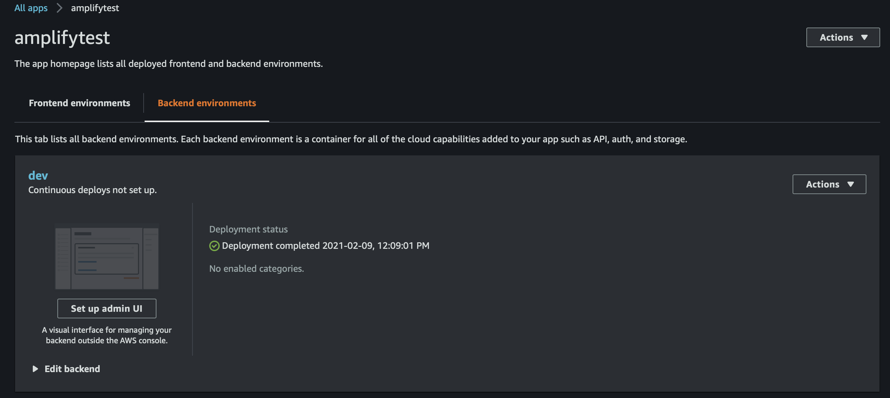

# Amplify test

POC of using AWS [Amplify Framework](https://docs.amplify.aws)

## Installation

```
npm install -g @aws-amplify/cli
```

## Configuration

_Using CLI_

```
amplify configure
```

_Using aws-vault_

```
aws-vault exec <profile-name> --
```

## New project

```
# press enter for the default options
amplify init
```

Project created at AWS Console



## Add new API

```
amplify add api
# for auth choose: Cognito Authentication, Default Configuration, Username and No, I am done.
# for api choose: No, I am done, N, Fine grained permission with fields and N
```

Go to ./amplify/backend/auth/amplifytest<hash>/amplifytest<hash>-cloudformation-template.yml

Add default attributes to Cognito, you can't change after creation.

```
Schema:
        
  -
    Name: email
    Required: true
    Mutable: true
  -
    Name: phone_number
    Required: true
    Mutable: true
  -
    Name: preferred_username
    Required: false
    Mutable: true
```

Go to ./amplify/backend/api/amplifytest/schema.graphql

Change schema model fiting your way

## Manual deployment

```
amplify push
```

## Mock

```
amplify mock api
```

## Frontend

https://docs.amplify.aws/start/getting-started/setup/q/integration/react

Create a React App

```
yarn add create-react-app --dev
npx create-react-app app
```

### Configure amplify

Add to ./src/App.js

```
import Amplify from 'aws-amplify'
import awsExports from './aws-exports'
Amplify.configure(awsExports)
```

### Add Authenticator plugin

Add to ./src/App.js

```
import { withAuthenticator } from '@aws-amplify/ui-react'
```

### Add hosting

```
amplify add hosting
```

### Deployment

```
amplify publish
```
